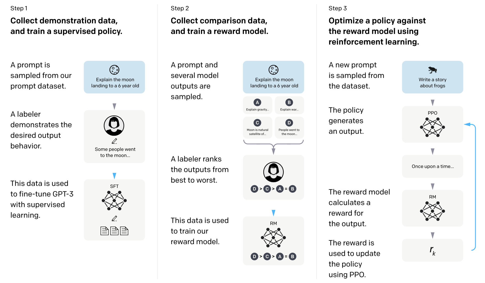

The following are notes while reading papers in the [2025 AI Engineer Reading List](https://www.latent.space/p/2025-papers) They are personal notes and are not refined for an external audience really. Just in case it's helpful for someone else. 


## **Frontier Models**

- **Improving Language Understanding by Generative Pre-Training** (GPT-1) (2018) by OpenAI
    - Introduces GPT-1 (117M params).
    - Key idea: Pre-train + fine-tuning. Use **unsupervised** learning to first pre-train a generative model on a large corpus of text, and then fine-tune this model on specific downstream tasks with **supervised** learning. This paper presents a foundational framework for transfer learning in NLP, where pre-trained models can be fine-tuned on specific tasks to achieve significant improvements in performance.
- **Language Models are Unsupervised Multitask Learners** (GPT-2) (2019) by OpenAI
    - Introduces GPT-2 (1.5B params)
    - Key idea: GPT-2 performs well on a variety of language tasks without needing task-specific training data. One of the innovative aspects of GPT-2 is its ability to adapt to diverse tasks simply by conditioning on task-specific **prompts**.
        - When prompted with a question, it can generate a coherent answer based solely on its pre-training knowledge. For example, when evaluated on reading comprehension question-answering task, GPT-2 produces answer when conditioned on the reading material and a final token `A:` (Section 3.5), with greedy decoding. When evaluated on text summarization task, GPT-2 produces answer when conditioned on the article and the text `TL;DR:` .
        - When given a few examples within the prompt, the model can adapt its outputs to align closely with the demonstrated behavior in those examples. For example, when evaluated on machine translation task, GPT-2 produces translation when conditioned on examples pairs of the format `english sentence = french sentence` and then after a final prompt of `english sentence =`, with greedy decoding.
- **Language Models are Few-Shot Learners** (GPT-3) (2020) by OpenAI
    - Introduces GPT-3 (175B params)
    - Key idea: the GPT-3 paper demonstrated that **scaling up** LLMs greatly improves few-shot performance, **without extensive fine-tuning**. GPT-3 is trained without fine-tuning and performs tasks purely based on prompting.
        - Model performance improves with prompting, and with the number of examples in the model’s context. Few-shot learning also improves dramatically with model size.
        - In-context learning: providing inference-time demonstrations to the model. The terms “zero-shot”, “one-shot”, and “few-shot” refer to the number of demonstrations provided at inference time.
        - The models scale up well and didn’t hit the ceiling yet.
- **Evaluating Large Language Models Trained on Code** (Codex) (2021) by OpenAI
    - Key idea: Codex models are GPT models fine-tuned on code to complete coding tasks. The paper focuses on generating standalone Python functions from docstrings. The correctness of the generated code is evaluated automatically against unit tests.
        - Models
            - Codex is a GPT model fine-tuned on publicly available code from GitHub.
            - Codex-S, standing for “supervised fine-tuned”, is further trained on a dataset of standalone, correctly-implemented Python functions.
            - Codex-D is trained on pairs of function signatures, reference solutions, and corresponding docstrings. The model focuses on generating docstrings from given implementation.
        - Codex uses repeated sampling from the model. By generating multiple code samples for a given prompt, the chance of obtaining at least one solution increased significantly.
        - Pass@k evaluation metrics: the probability of a model generating at least one correct solution within k samples.
- **Training language models to follow instructions with human feedback** (InstructGPT) (2022) by OpenAI
    - Key: After supervised fine-tuning, use RLHF to align the model.
        - Misalignment: the objective function of LLM - predicting the next word - is different from the objective of “following user instructions carefully and safely and helpfully”. Thus, the LLM objective is *misaligned*.
        - RLHF:
            - Step 1: Collect demonstration data of desired behavior, and perform supervised fine-tuning.
            - Step 2: Collect comparison data of model outputs and human ranking, to train a reward model.
            - Step 3: Fine-tune the model with RL, using PPO algorithm.
        - Alignment tax occurs when an alignment procedure negatively impacts performance on certain tasks. The author discussed mitigating this by adding pretraining updates to the PPO fine-tuning process.
    - Aside: The initial ChatGPT model is a sibling model of InstructGPT.
    
    
    
- **GPT-4 Technical Report** (GPT-4) (2023) by OpenAI
    - Key Idea: GPT-4 is a **multimodal** model capable of processing both image and text input to generate text outputs. The paper describes methods for **reliably predicating** model capabilities and mitigating safety risks through reinforcement learning from human feedback (**RLHF**).
        - Predictable scaling: Training LLM is expensive. OpenAI created infrastructure and optimization methods with consistent behavior across various scale. Model capabilities is predicated by fitting a power law.
        - RLHF: Simply increasing the size of language models doesn’t guarantee improved alignment with user intent. LLMs can still produce false, toxic, or unhelpful outputs. RLHF is used to fine-tune the model. This involves collecting demonstration data of desired behavior and comparison data where human labelers rank different outputs.
            - RLHF significantly enhances the models’s safety by reducing the likelihood of generating harmful content and improving the model’s ability to follow user instructions. However, RLHF doesn’t appear to significantly improve model’s capabilities. Evaluation shows that the base GPT-4 and post-RLHF model achieve similar scores on some benchmarks.
- [GPT-4o](https://openai.com/index/hello-gpt-4o/) (2024) by OpenAI
    - Prior to GPT-4o, ChatGPT supported voice through a pipeline of three separate models: audio to text → GPT-4 → text to audio. This had high latency, and GPT-4 lost a lot of information because it couldn’t directly observe tone, multiple speakers or background noise, and it couldn’t output laughter, singing or express emotion.
    - GPT-4o is a trained end-to-end across text, vision, and audio, meaning that all inputs and outputs are processed by the same model.
- [GPT-o1](https://openai.com/index/introducing-openai-o1-preview/), [technical report](https://openai.com/index/learning-to-reason-with-llms/), [system card](https://openai.com/index/openai-o1-system-card/) (2024) By OpenAI
    - GPT-o1 spends more time thinking before responding. It’s ”a significant advancement for complex reasoning tasks and represents a new level of AI capability”. O1 ranks 89th percentile on Codeforces, among top 500 students in USA Math Olympiad, and exceeds human PhD-level on a benchmark of physics, biology, and chemistry problems.
    - O1 uses chain of thought to think longer before responding. The chain of thought is hidden from the user though.
    - Compared with GPT-4o, o1 is slightly worse at text writing, but better at programming, data analysis, and math.
- **Deliberative Alignment: Reasoning Enables Safer Language Models** (GPT-o3) (2024) by OpenAI
    - TL;DR: Instead of aligning the model using human-labelled outputs and RLHF that implicitly encodes safety specifications, ask the model to reason through safety specifications explicitly with CoT and then perform RL. The complex reasoning ability, enabled by CoT, is foundational here.
    - Previously, LLMs are aligned using Supervised Fine Tuning (SFT) and Reinforcement Learning from Human Feedback (RLHF). There are two limitations with this approach. First, LLMs respond instantly without deliberation even in complex safety scenarios. Second, LLMs infer safety standards indirectly from labelled examples, instead of directly learning the safety specifications.
    - Deliberative Alignment addresses the two issues by teaching LLM to explicitly reason through safety specifications before producing an answer, using the chain-of-thought (CoT) reasoning ability introduced in GPT-o1.
    - The method involves two core stages, integrating process-based and outcome-based supervision. The training procedure requires **no human-labeled completions**.
        - In the first stage, teach the model to reason through safety specifications with CoT using supervised fine-tuning on `(prompt, CoT, output)`. The dataset is constructed by prompting another o-type model with the safety specifications, generating model completions, and stripping away the safe specifications from the prompt.
        - In the second stage, use RL to train the model. The reward model is a judge LLM that is given the safety specifications.
- **The Claude 3 Model Family: Opus, Sonnet, Haiku** (Claude 3) (2024) by Anthropic
    - Not particularly interesting
- “Gemini: A Family of Highly Capable Multimodal Models” (Gemini 1) (2023) by DeepMind
    - Not particularly interesting
- **LLaMA: Open and Efficient Foundation Language Models** (LLaMA 1) (2023) by Meta
    - The objective is to train a series of language models that deliver optimal performance across different **inference** budgets. Smaller models trained on more data can be more efficient at inference, making them cheaper to run in real-world applications, despite potentially longer training times.
    - LLaMA models are trained on more tokens than typically used and achieve performance similar to other larger models like GPT-3, Chinchilla and PaLM. LLaMa 1 is trained exclusively on public data.
- **LLaMA 2: Open Foundation and Fine-Tuned Chat Models** (LLaMA 2) (2023) by Meta
    - Fine-tunes for chat: LLaMA 2-Chat
    - Llama 2 uses a technique called "Ghost Attention" (GAtt), which involves augmenting user messages with instructions throughout the dialogue history during fine-tuning. This allows the model to consistently adhere to instructions over multiple turns. E.g. “Ack like Washington”.
- **The Llama 3 Herd of Models** (LLaMA 3) (2024) by Meta
    - LLaMa 3 405B. The paper identified three key levers to develop LLM:
        - Data: Improved both quantity and quality. LLaMA 3 was trained on 15T tokens, compared to 1.5T  for Llama 2.
        - Scale: Trained at a larger scale with 50x FLOPs than Llama2.
        - Managing complexity: To improve scaling, use supervised finetuning (SFT), rejection sampling (RS) and direct preference optimization (DPO), instead of RLHF with PPO.
    - Shared details about the development process. Dataset construction, large-scale training, model architecture, multimodality support, etc.
    - Maybe worth a more in-depth read?
- **DeepSeek LLM: Scaling Open-Source Language Models with Longtermism** (DeepSeek-v1) (2024)
    - Explores scaling law of hyperparameters. Proposes new scaling law variant. Argues that scaling behavior is affected by the quality of dataset.
- **DeepSeek-V2: A Strong, Economical, and Efficient Mixture-of-Experts Language Model** (DeepSeek-v2) (2024)
    - DeepSeek-v2 provides economical training and efficient inference. It replaces traditional multi-head attention with multi-head latent attention to reduce KV cache, and uses MoE to reduce training cost. With only 21B activated params, it achieves similar performance with Llama 70B.
    - MLA: See [MHA vs. MQA vs. GQA vs. MLA](https://www.notion.so/MHA-vs-MQA-vs-GQA-vs-MLA-1818cacb1fea804cb3cbe40ee55ff31a?pvs=21)
- **DeepSeek-v3 Technical Report** (DeepSeek-v3) (2024)
    - On top of DeekSeek-v2’s, adds an auxiliary-loss-free load balancing to DeekSeekMoE, and Multi-Token Prediction (MTP). Cost-effective due to using FP8 mixed precision training and meticulous engineering optimizations in the training framework. Achieved economical efficiency and strong performance.
        - MoE model performance suffer from unbalanced expert load. Auxiliary loss is a common solution but it could impair model performance. DeepSeek-v3 introduces a bias term and dynamically adjust it during training time to encourage load balancing.
        - MTP: Introduced by Meta. Predict multiple tokens instead of a single one at each position.
- **DeepSeek-R1: Incentivizing Reasoning Capability in LLMs via Reinforcement Learning** (DeepSeek-R1) (2025)
    - DeepSeek-R1-Zero represents a pure RL approach without SFT. Group Relative Policy Optimization (GRPO) is used. During the training process, the model learned to use more test-time compute (by generating more thinking tokens) and developed the reasoning ability!
        - This shows the power of RL: instead of explicitly teaching the model how to solve a problem, just provide it with the right incentives, and it autonomously develops a problem-solving strategies.
        - DeepSeek-R1-Zero still suffers from issues like poor readability and language mixing.
    - To address DeepSeek-R1-Zero’s issues, DeepSeek-R1 uses a SFT → RL → SFT → RL pipeline.
        - The first SFT phase focuses on reasoning ability and readability. Uses thousands of CoT examples.
        - The first RL phase focuses on reasoning ability, and introduced a language consistency reward to discourage language mixing.
        - The second SFT phase focuses on other general abilities like writing, role-playing.
        - The second RL phase focuses on helpfulness and safety.
    - Unsuccessful attempts
        - Process Reward Model (PRM).
        - Monte Carlo Tree Search (MCTS).

## Prompting, ICL, Chain-of-Thought

- **The Prompt Report: A Systematic Survey of Prompting Techniques** (2024)
    - Key idea: A comprehensive survey of prompting techniques. The authors review 1565 relevant papers, identifying 58 text-based prompting techniques and 40 techniques for other modalities.
        - I didn’t read the full paper but created a [NotebookLM](https://notebooklm.google.com/notebook/4cc30576-75a4-4f6a-a97e-190a9ceab9d1) generated from a [podcast](https://www.latent.space/p/learn-prompting) on it.
        - Zero-shot, few-shot, Chain of Thought, Tree of Thought, Decomposition, Ensembling, Self criticism.
        - Automatic Prompting Engineering using tools like DSPy.
        - Structured output prompting.
        - Multimodal prompting extends prompt engineering beyond text to incorporate other modalities like images, audio, and video.
- **Chain-of-Thought Prompting Elicits Reasoning in Large Language Models** (2022)
    - Key idea: Chain-of-thought prompting improves the reasoning ability of the model by prompts consisting of triples: <input, chain of though, output>. A chain of thought is a series of intermediate natural language reasoning steps that lead to the final output.
        - An emergent ability is a capability that arises unexpectedly as a model's scale increases. Chain-of-thought prompting is considered an emergent ability because it only shows significant performance improvements when applied to sufficiently large language models.
- **Tree of Thoughts: Deliberate Problem Solving with Large Language Models** (2023)
    - Key idea: A generalization of chain-of-thought prompting. ToT maintains a tree of thoughts, where thoughts represent coherent language sequences that serve as intermediate steps toward solving a problem. Tree-search algorithm like BFS and DFS can be used to traverse the tree.
        - ToT is implemented by framing a problem as a search over a tree, where each node is a state representing a partial solution, and each branch is an operator that modifies it. A human user prompts the LLM to solve the problem via a multi-round conversation. Throughout the ToT process, the user plays an active role, monitoring the output, providing feedback, and making strategic decisions.
            - Problem definition and decomposition. The human user begins by analyzing the problem and determining how it can be decomposed into a series of smaller, manageable steps.
            - Prompt engineering. The human user crafts a set of prompts to guide the LLM through the ToT process. Key prompts include:
                - Propose prompt: instruct LLM to generate next steps.
                - Value prompt: instruct LLM to evaluate generated steps and accessing the likelihoods of leading to a solution.
                - Vote prompt: If the process involves comparing multiple thoughts / partial solutions, instruct the LLM to select the most promising one.
            - Search algorithm: the user chooses the algorithm to search the tree.
        - A sample conversation with GPT-4, showcasing ToT prompting.
            - Though the paper defines ToT as a multi-round conversations that involves multi-round prompting, GPT-4 can follow the ToT instruction in a single prompt.
            - The “Imagine three different experts” prompt is from https://github.com/dave1010/tree-of-thought-prompting

```

User: Imagine three different experts are answering this question.
All experts will write down 1 step of their thinking,
then share it with the group.
Then all experts will go on to the next step, etc.
If any expert realises they're wrong at any point then they leave.

The question is the Game of 24. The numbers are: 7, 1, 4, and 3. You need to use all 4 numbers to reach 24. You can use operators like +, -, *, /. 

Please generate output in ASCII chars only, no markdown.

LLM: Step 1: Expert 1
Let's start by multiplying 7 and 3:
7 * 3 = 21

Step 2: Expert 2
Now, we have 21 and the numbers 1 and 4 left. I'll try adding 4 to 21:
21 + 4 = 25

Step 3: Expert 3
That doesn't give us 24. I think I will try a different approach. I will divide 4 by 1:
4 / 1 = 4

Step 4: Expert 1
We now have 21 and 4. Let me subtract 4 from 21:
21 - 4 = 17

Step 5: Expert 2
Wait, I realize that we need to add something to get 24. I’ll go back to my calculation.
7 * 3 = 21, then I need to subtract 1 from 21:
21 - 1 = 20

Step 6: Expert 3
Hmm, 20 still isn’t the right result. I’m going to leave the discussion.

Step 7: Expert 1
Since Expert 3 left, I’m still trying. Let's add 4 to 20:
20 + 4 = 24!

Final solution:
7 * 3 - 1 + 4 = 24
```


## Retrieval Augmented Generation

- **Retrieval-Augmented Generation for Knowledge-Intensive NLP Tasks** (RAG) (2020) by Meta
    - RAG consists of a pre-trained retriever and a pre-trained seq2seq generator. To answer a query, the retriever retrieves top-k most relevant documents from the document index, and pass both the query and retrieved documents to the generator to generate a response.
    - The retriever follows a bi-encoder architecture: a BERT *document encoder* builds a document index and a BERT *query encoder* produces a query representation. Top-k documents are retrieved by MIPS (Maximum Inner Product Search), which can be approximately solved in sub-linear time.
    - The retriever and generator are jointly trained, without direct supervision on the document retrieval output. In this paper, the document encoder is frozen because it’s costly to update the document index whenever the document encoder’s parameters are updated.
    - My thoughts:
        - In an RAG, is it possible to freeze generator and only train retriever? When the generator is frozen, gradients cannot backprop from the RAG’s output to the retriever. This means the retriever cannot be directly trained using the final output loss (e.g. log-likelihood, cross-entropy on the generated text). Instead, the retriever’s loss must be calculated independently, based on the quality of the retrieved documents. Some possible approaches:
            - If you have labeled data about which documents should be retrieved, if you compute loss based on the label document and retrieved document. This is a well-solved problem in information retrieval (IR).
            - Use RL where the retriever is treated as a policy that selects documents, and the generator’s output is used to compute a reward signal. A reward is computed for the generator’s output, and the retriever is trained using policy gradient methods to maximize expected rewards.
        - Is it possible to build an RAG with only an LLM api, but not an actual LLM model? If so, how do you train it? This is exactly the situation described above.
- RAG techniques
    - Chunking is the process of breaking down large documents or data into smaller chunks before indexing them for retrieval. This improves retrieval granularity.
    - Reranking is the process of reranking initial set of retrieved documents by based on a more sophisticated scoring mechanism.
    - HyDE (Hypothetical Document Embedding) improves retrieval by asking the generator to generate a "hypothetical" document based on the query and using it for retrieval.
- **From Local to Global: A Graph RAG Approach to Query-Focused Summarization** (GraphRAG) (2024) by Microsoft
    - My note: If you just need the high-level idea of GraphRAG, it’s probably better to read [Microsoft’s research blog](https://www.microsoft.com/en-us/research/blog/graphrag-unlocking-llm-discovery-on-narrative-private-data/) or [this talk by the Neo4j’s founder](https://www.youtube.com/watch?v=knDDGYHnnSI).
    - A standard RAG retrieves via vector similarity. A GraphRAG retrieves via a LLM-generated knowledge graph, which provides substantial improvements.
    - The standard RAG performs poorly on questions that require “connecting the dots”, i.e. traversing separate pieces of information through their shared attributes, or require a holistic understanding of the entire large document.
    - The GraphRAG performs better in such problems because it’s easy to traverse connected entities in a knowledge graph, and the LLM-generated knowledge graph already provides structure (e.g. clustering) that encodes the content.
    - The GraphRAG is also more explainable and deterministic than RAG, because the knowledge graph is human-friendly while vector similarity is not.
    - Basic steps to create and use a LLM-generated knowledge graph
        - Prompt LLM to identify entities (nodes) and relationships (edges) in the dataset.
        - Construct the knowledge graph using a graph database or library.
        - Create a bottom-up clustering that organizes the data hierarchically into semantic clusters. The clusters are like “summaries” and helps with holistic understanding.
        - To answer a query, prompt LLM to extract entities and relationships from the query, and search the graph to find relevant information.